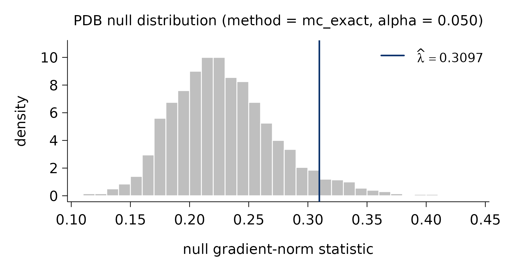

# The PIC paradigm

This page explains the idea behind the **Pivotal Information Criterion
(PIC)** and, in particular, how `picreg` chooses the regularization
parameter \lambda **without** cross-validation. The formal statements
and proofs live in the companion paper, [Sardy, van Cutsem and van de
Geer (2026)](https://arxiv.org/abs/2603.04172); here we keep the
exposition deliberately intuitive.

## Sparse models and the tuning problem

Most sparse estimators solve a penalized problem of the form

\hat{\boldsymbol\beta}(\lambda) \\=\\ \arg\min\_{\boldsymbol\beta}\\
L(\boldsymbol\beta) \\+\\ \lambda \\ \mathrm{pen}(\boldsymbol\beta),

where L measures fit and \mathrm{pen} shrinks coefficients toward zero.
The single knob \lambda \ge 0 controls how many variables survive:
larger \lambda means a sparser model. Everything hinges on how \lambda
is chosen.

The default answer in practice is **cross-validation** (CV). But CV
optimizes *out-of-sample prediction error* - which is **not** the same
target as recovering the true set of active variables. A model can
predict well while including many spurious predictors, and the
CV-optimal \lambda is typically far too small for selection, letting
noise variables in. This selection-versus- prediction distinction is
well documented in the model-selection literature.

## Fixing \lambda at the detection boundary

PIC takes a different route: it fixes \lambda at the *detection
boundary*: the smallest penalty level that, in the **absence of any
signal**, leaves the gradient of the fit term below the penalty and
therefore returns the empty model. Equivalently, this is the smallest
\lambda that makes the origin \boldsymbol\beta = \mathbf 0 a **local
minimum** of the penalized objective under the null H_0:\boldsymbol\beta
= \mathbf 0.

Formally, consider the gradient-norm statistic of the (transformed) loss
at the origin,

\Lambda \\=\\ \left\\ \nabla\_{\boldsymbol\beta}\\(\phi \circ
\ell_n)\bigl(g(\hat\beta_0 \mathbf 1), \hat\sigma; (X, Y_0)\bigr)
\right\\\_\infty, where Y_0 is drawn under H_0 and the nuisance
parameters are set to their maximum-likelihood estimates. The detection
boundary is the upper \alpha-quantile of \Lambda,

\lambda\_\alpha^{\mathrm{DB}} \\=\\ q\_{1-\alpha}(\Lambda),

so that, by construction, \mathbb P\_{H_0}(\hat{\boldsymbol\beta} =
\mathbf 0) = 1 - \alpha. In words: choose the smallest \lambda that
keeps pure noise from being selected with probability 1-\alpha. The
level \alpha (default 0.05) plays the role of a nominal false-discovery
level under the null. Choosing \lambda \< \lambda\_\alpha^{\rm PDB}
floods the model with false positives, whereas \lambda \>
\lambda\_\alpha^{\rm PDB} needlessly misses true signals.

## Why “pivotal”

The transformations (\phi, g) - family-specific and built into
`picreg` - are chosen precisely so that the distribution of \Lambda is
(asymptotically) **pivotal**: free of the unknown nuisance parameters
(the intercept \beta_0 and scale \sigma). As a consequence the quantile
\lambda\_\alpha^{\mathrm{PDB}} — the *pivotal* detection boundary —
depends only on the design matrix X, the family, and the level \alpha,
**never on the observed response** \mathbf y. It can therefore be
computed *before* fitting (and reused across penalties). Because the
choice is calibrated for *selection* rather than prediction, PIC
typically achieves sharper support recovery than CV-tuned competitors -
and, under standard sparsity assumptions, a sharp *phase transition* for
exact recovery, a phenomenon well documented in the compressed-sensing
literature.

The companion paper, [Sardy, van Cutsem and van de Geer
(2026)](https://arxiv.org/abs/2603.04172), gives a table listing the
base loss \ell_n and the associated pair (\phi, g) for each of the six
families.

## Computing the boundary in practice

`picreg` offers three ways to obtain the quantile of \Lambda, via the
`lambda_method` argument of
[`pic()`](https://vcmaxouuu.github.io/picreg/reference/pic.md):

- `"mc_exact"` (default): family-aware Monte Carlo — the most accurate,
  ideal for small to moderate problems.
- `"mc_gaussian"`: a CLT-based Gaussian approximation of the gradient,
  essentially equivalent once n is moderately large and noticeably
  faster.
- `"analytical"`: a closed-form Bonferroni bound, deterministic and
  O(1), for very large-scale problems.

The diagnostic
[`pdb_asymptotic()`](https://vcmaxouuu.github.io/picreg/reference/pdb_asymptotic.md)
lets you visualize how the three agree as n grows.

## Seeing it on data

``` r

library(picreg)
data(QuickStartExample)
fit <- pic(QuickStartExample$X, QuickStartExample$y)
```

[`pdb_summary()`](https://vcmaxouuu.github.io/picreg/reference/pdb_summary.md)
reports the selector and the simulated null distribution from which
\hat\lambda\_\alpha^{\mathrm{PDB}} is read off:

``` r

pdb_summary(fit)
#> PDB lambda selector
#> -------------------
#>   method       : mc_exact
#>   alpha        : 0.05
#>   n_simu       : 2,000
#>   lambda_hat   : 0.3097
#> 
#>   Null distribution:
#>    min     q05     q25  median     q75     q95     max  
#> 0.1124  0.1678  0.1989  0.2252  0.2547  0.3092  0.4344  
#> 
#>   mean = 0.2294      sd = 0.0438
```

Plotting the `lambda_pdb` component shows that null distribution with
the selected \hat\lambda marked — the value at which pure-noise
gradients are exceeded only with probability \alpha:

``` r

plot(fit$lambda_pdb)
```



That single, response-independent threshold is the whole point: no grid,
no folds, no re-fitting — just a calibrated boundary tuned for variable
selection.
