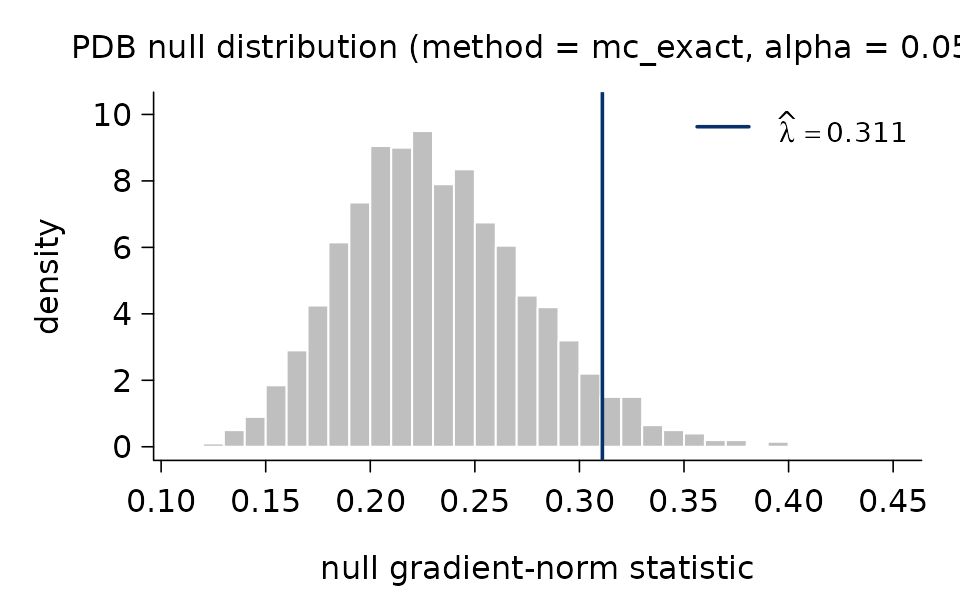
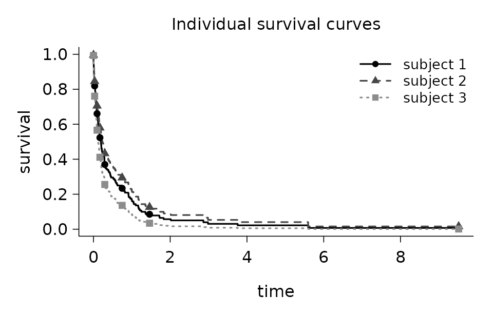
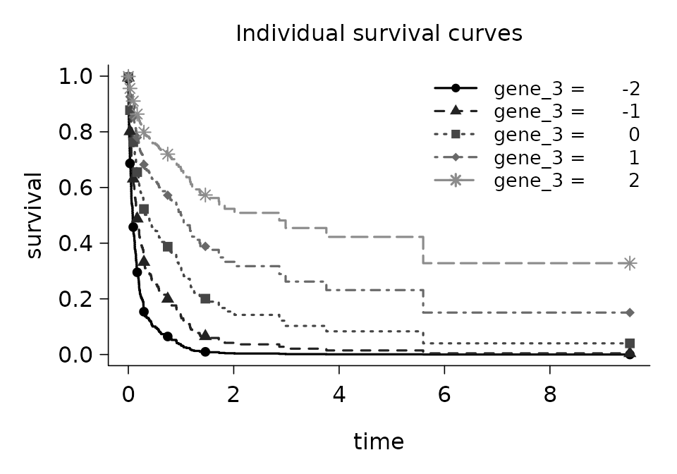
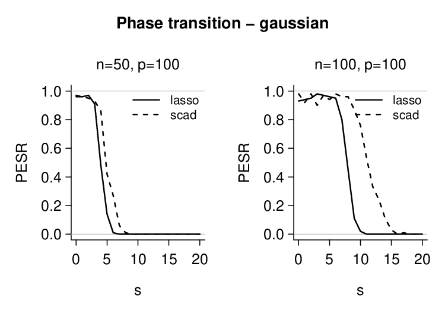
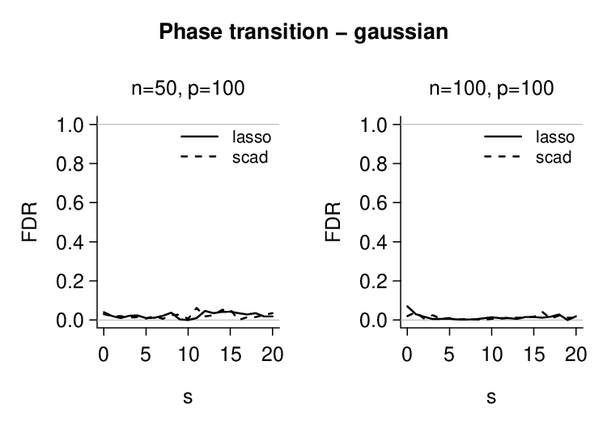
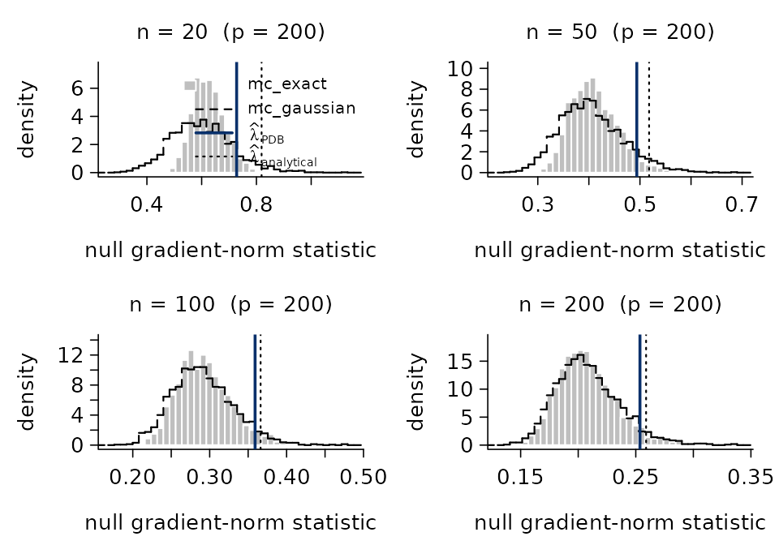

# An introduction to \`picreg\`

## Introduction

`picreg` is the R implementation of the **Pivotal Information
Criterion** (PIC) developed by Sardy, van Cutsem, and van de Geer in
<https://arxiv.org/abs/2603.04172>. PIC is a general framework to
improve on BIC and LASSO for fitting sparse regression linear models in
which the regularization parameter \lambda is selected automatically
from a *pivotal* statistic. As a result, PIC removes the need for
cross-validation and achieves more accurate support recovery by better
identifying the true non-zero coefficients. The package fits the
resulting estimators across six response distributions - Gaussian,
binomial, Poisson, exponential, Gumbel, and Cox - combined with three
sparsity-inducing penalties; \ell_1 (LASSO), the Smoothly Clipped
Absolute Deviation (SCAD), and Minimax Concave Penalty (MCP).

Given data \mathcal{D} = (X, y), where X \in \mathbb{R}^{n \times p}
denotes the design matrix and y \in \mathbb{R}^n the response vector, a
base loss l_n(\boldsymbol{\theta}, \sigma; \mathcal{D}) = \frac{1}{n}
\sum\_{i=1}^n l(\theta_i, \sigma; \mathcal{D}) (with a possible nuisance
parameter \sigma), and a sparsity-inducing penalty P (possibly
non-convex),
[`pic()`](https://vcmaxouuu.github.io/picreg/reference/pic.md) minimizes
the Pivotal Information Criterion (PIC) by solving
\min\_{\beta_0,\\\boldsymbol{\beta}}\left\\
\phi\bigl(l_n(\boldsymbol{\theta}, \sigma; \mathcal{D})\bigr) +
\lambda\_\alpha^{\mathrm{PDB}}\\ P(\boldsymbol{\beta})\right\\, \qquad
\boldsymbol{\theta} = g\bigl(\beta_0\mathbf{1} +
X\boldsymbol{\beta}\bigr), where \lambda\_\alpha^{\mathrm{PDB}} is the
pre-fixed for the parameter \lambda chosen as the upper \alpha-quantile
of a statistic \Lambda made pivotal with respect to unknown parameters
\sigma,\\ \beta_0 thanks to the distribution-specific pair (\phi,\\ g).

Internally, `picreg` uses FISTA (Fast Iterative Soft-Thresholding
Algorithm) as the optimization scheme.

## Installation

`picreg` is available on CRAN:

``` r

install.packages("picreg")
```

Alternatively, the development version can be installed from GitHub:

``` r

# install.packages("remotes")
remotes::install_github("VcMaxouuu/picreg")
```

Once installed, load it with:

``` r

library(picreg)
```

## Quick start

This section walks through the shared interface that all six
distributions expose: fitting a model, inspecting it, predicting on new
data, selecting the regularization parameter, and visualizing the
relevant quantities. Distribution-specific tooling is deferred to the
*Generalised linear models* section.

We illustrate the workflow on the default Gaussian distribution with the
LASSO (\ell_1) penalty. The package ships a small synthetic dataset
`QuickStartExample` (n = 100, p = 30, of which 5 active variables and 25
noise variables). Active columns are named `gene_1, ..., gene_5` and
noise columns `noise_1, ..., noise_25`.

``` r

data(QuickStartExample)
X <- QuickStartExample$X
y <- QuickStartExample$y
```

### Fitting a model

The simplest call to
[`pic()`](https://vcmaxouuu.github.io/picreg/reference/pic.md) returns a
fitted model with all defaults: Gaussian distribution, LASSO penalty,
automatic PDB selection of \lambda:

``` r

fit <- pic(X, y)
```

These defaults can be overridden through two main arguments:

- `family`: the response distribution: `"gaussian"` (default),
  `"binomial"`, `"poisson"`, `"exponential"`, `"gumbel"`, or `"cox"`.
- `penalty`: the sparsity-inducing penalty used during training:
  `"lasso"` (default), `"scad"`, or `"mcp"`.

Behind the scenes,
[`pic()`](https://vcmaxouuu.github.io/picreg/reference/pic.md)
standardizes the columns of `X` to zero mean and unit variance, computes
\lambda\_\alpha^{\mathrm{PDB}}, and minimizes the objective with FISTA.
A concise summary is available through the `summary` method:

``` r

summary(fit)
```

    ## pic fit summary
    ##   family    : gaussian
    ##   penalty   : lasso
    ##   lambda    : 0.311
    ##   dimensions: n = 100, p = 30
    ##   selected  : 5 / 30
    ##   intercept : 0.006603
    ## 
    ##   Non-zero coefficients (original scale):
    ##  variable coefficient
    ##    gene_3     -0.7508
    ##    gene_4     -0.6489
    ##    gene_1     -0.4028
    ##    gene_5      0.1380
    ##    gene_2     -0.0463

### Inspecting the fit

The returned object carries everything needed for downstream analysis:

``` r

# Number of selected features and their identifiers
fit$df
```

    ## [1] 5

``` r

fit$selected
```

    ## [1] "gene_1" "gene_2" "gene_3" "gene_4" "gene_5"

``` r

# Selected regularization parameter
fit$lambda
```

    ## [1] 0.3109731

``` r

# Family and penalty descriptors
fit$family
```

    ## family: gaussian (link g = identity, phi = sqrt)

``` r

fit$penalty
```

    ## lasso()

When `X` is supplied as a data frame, or as a matrix carrying column
names, `picreg` uses them throughout the output. As shown above,
`fit$selected` returns the **names** of the selected variables rather
than their integer indices. Bare matrices fall back to the default
`V1, ..., Vp` naming.

### Coefficients

The full coefficient vector is accessible either through `fit$beta`
(standardized, numeric vector) or through
[`coef()`](https://rdrr.io/r/stats/coef.html), which returns a
one-column sparse matrix (class `"dgCMatrix"`) on the **original** scale
of `X` by default; zero coefficients are printed as `.`. Note that
`fit$beta` is a bare numeric vector and carries no variable names,
whereas [`coef()`](https://rdrr.io/r/stats/coef.html) is more
informative: it labels every coefficient with its variable name (and
adds the `"(Intercept)"` row):

``` r

coef(fit)                          # original scale
```

    ## 31 x 1 sparse Matrix of class "dgCMatrix"
    ##             coefficient
    ## (Intercept)  0.00660255
    ## gene_1      -0.40277095
    ## noise_1      .         
    ## noise_2      .         
    ## noise_3      .         
    ## gene_2      -0.04628404
    ## noise_4      .         
    ## noise_5      .         
    ## noise_6      .         
    ## noise_7      .         
    ...

``` r

# coef(fit, standardized = TRUE)   # standardized scale; same as fit$beta
```

### Predicting on new data

The user can make predictions from the fitted object using the
[`predict()`](https://rdrr.io/r/stats/predict.html) function. The
primary argument is `newx`, a matrix of values for `X` at which
predictions are desired. Two types are universally available: `"link"`
(the linear predictor X\boldsymbol{\beta} + \beta_0) and `"response"`
(the mean response g(\eta)). In the Gaussian case of course (since g is
the identity), both types gives the same outputs. Binomial fits
additionally accept `type = "class"` for hard label prediction.

``` r

predict(fit, newx = X[1:5,])                  # response
```

    ## [1]  0.4305631  1.8606175 -1.0359871  1.1197544  0.2146807

``` r

predict(fit, newx = X[1:5,], type = "link")   # linear predictor
```

    ## [1]  0.4305631  1.8606175 -1.0359871  1.1197544  0.2146807

### Visualizing the fit

The standard `plot` method draws the non-zero coefficients in descending
order of absolute magnitude:

``` r

plot(fit)
```


Each segment represents the value of one selected coefficient. The
descending order makes the relative importance of the selected variables
immediately visible. Passing `standardized = FALSE` rescales the
displayed coefficients back to the original scale of X. In that case,
differences in predictor scales may distort the relative magnitudes of
the coefficients, so direct comparisons between them are generally no
longer meaningful.

### Selecting the regularization parameter

The parameter \lambda governs the trade-off between data fit and
sparsity. [`pic()`](https://vcmaxouuu.github.io/picreg/reference/pic.md)
selects it automatically as \lambda=\lambda\_\alpha^{\mathrm{PDB}}.

The selection of \lambda is calibrated such that, under the null
hypothesis H_0:\boldsymbol{\beta} = \mathbf{0}, the estimated model that
minimizes PIC returns no selected variables with high probability. To
that aim, the pivotal detection boundary \lambda\_\alpha^{\mathrm{PDB}}
is defined as the upper \alpha-quantile of \Lambda=\left\lVert
\nabla\_{\boldsymbol\beta}\left(\phi\circ l_n\right)
\left(g(\hat\beta_0\mathbf 1), \hat\sigma; (X, Y_0)\right)
\right\rVert\_\infty, that is, the gradient evaluated at
\boldsymbol{\beta} = \mathbf{0} given data sampled under the null
hypothesis Y_0. The nuisance parameters are set to their
maximum-likelihood estimates. By default `alpha = 0.05` in a
[`pic()`](https://vcmaxouuu.github.io/picreg/reference/pic.md) call. The
quantile depends only on X, the underlying distribution `family`, and
\alpha. It is independent of the observed response data y. As a result,
the tuning-free parameter \lambda\_\alpha^{\mathrm{PDB}} can be
determined a priori.

#### Calculation methods

The quantile is calculated via one of three methods, set through the
`lambda_method` argument of
[`pic()`](https://vcmaxouuu.github.io/picreg/reference/pic.md):

- **`"mc_exact"` (default).** Distribution/family-aware Monte Carlo: for
  each of `lambda_n_simu` draw, a null response is sampled, the
  distribution-specific gradient is evaluated at \boldsymbol{\beta} =
  \mathbf{0}, and its supremum norm is recorded. The empirical
  (1-\alpha) quantile of the simulated norms is returned.

- **`"mc_gaussian"`.** Samples the gradient directly from its Gaussian
  CLT limit \mathcal{N}\bigl(0,\\ c(n)\\\Sigma_X / n\bigr), with
  \Sigma_X = X^\top X / n and c(n) a distribution-specific scaling
  factor. Cheaper than `"mc_exact"` and essentially equivalent once n is
  moderately large.

- **`"analytical"`.** Closed-form Bonferroni bound, \Phi^{-1}\\\bigl(1 -
  \alpha / (2p)\bigr) \sqrt{c(n)/n}. Not based on a Monte-Carlo
  simulation, O(1), slightly conservative. Useful in ultra-high
  dimensions.

#### Visualizing the null distribution

Monte Carlo methods keep the simulated null statistics on the fit and
can be visualized by calling
[`plot()`](https://rdrr.io/r/graphics/plot.default.html) on
`fit$lambda_pdb`. By default
[`pic()`](https://vcmaxouuu.github.io/picreg/reference/pic.md) uses
`lambda_n_simu = 2000` Monte-Carlo simulations.

``` r

plot(fit$lambda_pdb)
```



The histogram shows the empirical distribution of the null and the
vertical line marks the selected \widehat{\lambda} at the (1-\alpha)
quantile. A more detailed text summary is available through
[`pdb_summary()`](https://vcmaxouuu.github.io/picreg/reference/pdb_summary.md):

``` r

pdb_summary(fit)
```

    ## PDB lambda selector
    ## -------------------
    ##   method       : mc_exact
    ##   alpha        : 0.05
    ##   n_simu       : 2,000
    ##   lambda_hat   : 0.311
    ## 
    ##   Null distribution:
    ##    min     q05     q25  median     q75     q95     max  
    ## 0.1135  0.1656  0.2014  0.2283  0.2606  0.3108  0.4406  
    ## 
    ##   mean = 0.2326      sd = 0.0444

The `"analytical"` method has no simulated draw and therefore nothing to
plot;
[`pdb_summary()`](https://vcmaxouuu.github.io/picreg/reference/pdb_summary.md)
then reports only the selector metadata.

#### Supplying \lambda manually

A value of \lambda known in advance - from a previous fit, from theory,
or to share the same regularization across penalties on the same
dataset - can be supplied directly via the `lambda` argument of
[`pic()`](https://vcmaxouuu.github.io/picreg/reference/pic.md). The PDB
calibration is then skipped. This is particularly useful when comparing
the three penalties (LASSO, SCAD, MCP) on the same problem, since the
PDB choice of \lambda does not depend on the penalty itself.

``` r

fit_lasso <- pic(X, y, penalty = "lasso", lambda = fit$lambda)
fit_scad  <- pic(X, y, penalty = "scad",  lambda = fit$lambda)
fit_mcp   <- pic(X, y, penalty = "mcp",   lambda = fit$lambda)

data.frame(
  penalty = c("lasso", "scad", "mcp"),
  df      = c(fit_lasso$df, fit_scad$df, fit_mcp$df),
  lambda  = c(fit_lasso$lambda, fit_scad$lambda, fit_mcp$lambda)
)
```

    ##   penalty df    lambda
    ## 1   lasso  5 0.3109731
    ## 2    scad  5 0.3109731
    ## 3     mcp  5 0.3109731

## Generalised linear models

The interface described in the *Quick start* applies unchanged to all
six distributions. Each one is identified by a name string passed to
`family =` and is characterized by the pair (\phi, g): \phi applied to
the base loss, and g relating the linear predictor \eta = \beta_0 +
X\boldsymbol{\beta} to the mean response.

### Gaussian

`"gaussian"` is the default `family` argument for
[`pic()`](https://vcmaxouuu.github.io/picreg/reference/pic.md). The
objective function for the Gaussian distribution uses the MSE for l_n
and \phi(\cdot) = \sqrt{\cdot}, g(\cdot) = \mathrm{Id} as
transformations, resulting in the square-root LASSO objective
\min\_{\beta_0,\\\boldsymbol{\beta}}\left\\\sqrt{\frac1n\sum\_{i=1}^n\left(y_i-(\beta_0+\mathbf
x_i^T\boldsymbol\beta\right)^2} + \lambda\_\alpha^{\mathrm{PDB}}\\
P(\boldsymbol{\beta})\right\\. This is the canonical pivotal alternative
to the standard squared loss: it makes the gradient at
\boldsymbol{\beta} = 0 scale-free, so the PDB threshold does not require
an estimate of the noise standard deviation.

### Binomial

`family = "binomial"` is used for logistic regression when the responses
y_i \in \\0, 1\\ are binary. In this case, `pic` requires `y` to be a
vector containing only 0 and 1 values. Any other format or values in `y`
will return an error. `picreg` uses a variance-stabilized transformation
of the Bernoulli likelihood. With \phi(\cdot) = \mathrm{Id} and the
logistic link \theta_i = g(\eta_i) = (1 + e^{-\eta_i})^{-1},
`pic(family = "binomial")` minimizes \min\_{\beta_0,
\boldsymbol\beta}\left\\ \frac{1}{n}\sum\_{i=1}^{n}\left( 2 y_i
\sqrt{\tfrac{1 - \theta_i}{\theta_i}} + 2 (1 - y_i)
\sqrt{\tfrac{\theta_i}{1 - \theta_i}} \right)+\lambda\_\alpha^{\rm
PBD}P(\boldsymbol\beta)\right\\, \qquad \theta_i =
\frac{1}{1+\exp(-(\beta_0+\mathbf x_i^T\boldsymbol\beta))} The classical
logistic link is preserved; only the loss itself is modified to obtain a
pivotal gradient at the null.

``` r

data(BinomialExample)
X <- BinomialExample$X
y <- BinomialExample$y
fit_binom <- pic(X, y, family = 'binomial')
print(fit_binom)
```

    ## pic fit (pic.binomial)
    ##   family   : binomial
    ##   penalty  : lasso
    ##   lambda   : 0.191493
    ##   selected : 5 / 50
    ##   intercept: -0.281037

Binomial fits additionally support hard label prediction when passing
`type = "class"` to the
[`predict()`](https://rdrr.io/r/stats/predict.html) function.

``` r

predict(fit_binom, newx = X[1:5, ], type = 'response')
```

    ## [1] 0.4193490 0.7368105 0.2277823 0.3310245 0.5189012

``` r

predict(fit_binom, newx = X[1:5, ], type = 'class')
```

    ## [1] 0 1 0 0 1

### Poisson

For count responses y_i \in \mathbb{N}, the same pivotalization recipe
is applied to the Poisson likelihood. With \phi(\cdot) = \mathrm{Id} and
the canonical log link \theta_i = g(\eta_i) = e^{\eta_i},
`pic(family = "poisson")` minimizes \min\_{\beta_0,
\boldsymbol\beta}\left\\ \frac{1}{n}\sum\_{i=1}^{n}\\\left( \frac{2
y_i}{\sqrt{\theta_i}} + 2 \sqrt{\theta_i} \right)+\lambda\_\alpha^{\rm
PDB}P(\boldsymbol\beta)\right\\, \qquad \theta_i = \exp(\beta_0+\mathbf
x_i^T\boldsymbol\beta). The canonical log link is kept unchanged; the
pivotal property is obtained through the loss rather than through the
link. `pic` requires `y` to be a vector containing only non negative
values.

### Exponential

The standard Exponential negative log-likelihood is used directly, no
transformation are needed. With \phi(\cdot) = \mathrm{Id} and \theta_i =
g(\eta_i) = e^{\eta_i}, `pic(family = "exponential")` minimizes
\min\_{\beta_0, \boldsymbol\beta}\left\\
\frac{1}{n}\sum\_{i=1}^{n}\left( \log{\theta_i} + \frac{y_i}{\theta_i}
\right)+\lambda\_\alpha^{\rm PDB}\right\\, \qquad \theta_i =
\exp(\beta_0+\mathbf x_i^T\boldsymbol\beta). Again, `pic` requires `y`
to be a vector containing only non negative values.

### Gumbel

The Gumbel distribution targets location-scale models with extreme-value
noise. The base log-likelihood is l_n(\boldsymbol{\theta}, \sigma) =
\log(\sigma) + \frac{1}{n}\sum\_{i=1}^{n} \bigl(z_i + e^{-z_i}\bigr),
\qquad z_i = \frac{y_i - \theta_i}{\sigma}. With \phi(\cdot) =
\exp(\cdot) and the identity link \theta_i = g(\eta_i) = \eta_i, the
optimization objective is \phi\bigl(\ell_n(\boldsymbol{\theta}, \sigma;
\mathcal{D})\bigr) = \exp\bigl(\ell_n(\boldsymbol{\theta},
\sigma)\bigr). The scale parameter \sigma is re-estimated internally by
maximum likelihood at every iteration; the user does not pass it
explicitly.

### Cox

The Cox proportional-hazard model is the survival counterpart of the
other GLMs. The response `y` must be a two-column matrix (t_i, \delta_i)
of event times and event indicators (\delta_i = 1 if event, 0 if
censored). With \phi(\cdot) = \sqrt{\cdot} and \theta_i = g(\eta_i) =
\eta_i, `pic(family = "cox")` minimizes the square-root normalized
partial log-likelihood: \min\_{\boldsymbol\beta}\left\\ \sqrt{
-\frac1n\left( \sum\_{i=1}^{n} \delta_i \eta_i - \sum\_{i=1}^{n}
\delta_i \log\left(\sum\_{j \in R_i} e^{\eta_j}\right)
\right)}+\lambda\_\alpha^{\rm PDB}P(\boldsymbol\beta)\right\\, where R_i
denotes the risk set at event time t_i. Breslow approximation for tied
event times is used. When `family = "cox"` is used, `pic` automatically
fits the model without an intercept.

The package ships a small survival dataset `CoxExample` (n = 250, p =
50, with 5 active variables and 45 noise variables) generated under an
exponential proportional-hazards model with independent exponential
censoring. The censoring rate is roughly 40\\. The response is a
two-column matrix with columns `time` and `event`, the standard input
format for `family = "cox"`.

``` r

data(CoxExample)
X_cox <- CoxExample$X
y_cox <- CoxExample$y
print(y_cox[1:7, ])
```

    ##             time event
    ## [1,] 0.005565264     1
    ## [2,] 0.017211836     1
    ## [3,] 0.017762667     1
    ## [4,] 0.794925355     0
    ## [5,] 0.008978275     1
    ## [6,] 0.123304085     1
    ## [7,] 0.179501892     0

``` r

fit_cox <- pic(X_cox, y_cox, family = "cox")
print(fit_cox)
```

    ## pic fit (pic.cox)
    ##   family   : cox
    ##   penalty  : lasso
    ##   lambda   : 0.0476666
    ##   selected : 5 / 50

In addition to the shared interface, `pic.cox` objects carry the Breslow
estimates of the baseline cumulative hazard H_0(t) and the baseline
survival S_0(t) = \exp\\\bigl(-H_0(t)\bigr), accessible directly through
`fit_cox$baseline_cumulative_hazard` and `fit_cox$baseline_survival`.
They are also visualized through
[`plot_baseline()`](https://vcmaxouuu.github.io/picreg/reference/plot_baseline.md):

``` r

plot_baseline(fit_cox)
```


For any new design,
[`predict_survival_function()`](https://vcmaxouuu.github.io/picreg/reference/predict_survival_function.md)
returns the common time grid and a matrix of survival probabilities, one
column per subject. The result is plotted directly with
[`plot_survival_curves()`](https://vcmaxouuu.github.io/picreg/reference/plot_survival_curves.md):

``` r

sf <- predict_survival_function(fit_cox, newx = X_cox[1:3, ])
plot_survival_curves(sf)
```



To visualize how a selected variable affects the predicted survival
curve,
[`feature_effects_on_survival()`](https://vcmaxouuu.github.io/picreg/reference/feature_effects_on_survival.md)
evaluates the model on a set of “profile” subjects where all covariates
are fixed at their column means except the chosen feature, which varies
across several values. By default, the function uses four empirical
quantiles of the feature, or all distinct values for small categorical
or ordinal variables. The result can be passed directly to
[`plot_survival_curves()`](https://vcmaxouuu.github.io/picreg/reference/plot_survival_curves.md).
Only variables in the selected support can be queried.

``` r

fx <- feature_effects_on_survival(fit_cox, idx = "gene_1")
plot_survival_curves(fx)
```


A custom grid of values can also be supplied explicitly through the
`values` argument:

``` r

fx <- feature_effects_on_survival(fit_cox,
                                  idx    = "gene_3",
                                  values = c(-2, -1, 0, 1, 2))
plot_survival_curves(fx)
```



## Assessing a fit

Once a model has been trained,
[`assess()`](https://vcmaxouuu.github.io/picreg/reference/assess.md)
reports a compact set of out-of-sample metrics tailored to the
distribution. It accepts a fit, a new design matrix, and the
corresponding response, and returns a two-column `data.frame` with
columns `metric` and `value`:

``` r

data(QuickStartExample)
X <- QuickStartExample$X
y <- QuickStartExample$y
fit <- pic(X, y)

assess(fit, newx = X, newy = y)
```

    ##  metric     value
    ##     MSE 1.8231585
    ##     MAE 1.0851878
    ##      R2 0.5900742

The metrics depend on the distribution/family:

| Family      | Metrics reported                |
|-------------|---------------------------------|
| Gaussian    | MSE, MAE, R²                    |
| Binomial    | accuracy, AUC, deviance         |
| Poisson     | MSE, MAE, deviance              |
| Exponential | MSE, MAE, deviance              |
| Gumbel      | MSE, MAE, deviance              |
| Cox         | C-index, partial log-likelihood |

For Cox fits, `newy` must be a two-column matrix `(time, event)`, the
same format used at training:

``` r

data(CoxExample)
fit_cox <- pic(CoxExample$X, CoxExample$y, family = "cox")
assess(fit_cox, newx = CoxExample$X, newy = CoxExample$y)
```

    ##                  metric     value
    ##                 c_index 0.8354248
    ##  partial_log_likelihood 2.5264204

### A note on bias and refitting

A word of caution when interpreting the predictive metrics: by default
[`pic()`](https://vcmaxouuu.github.io/picreg/reference/pic.md) is called
with `relax = FALSE`, so the reported coefficients still carry the
shrinkage induced by the penalty. This is particularly pronounced with
the LASSO (`penalty = "lasso"`), whose bias on non-zero coefficients
does not vanish even as the signal grows. SCAD and MCP reduce this
effect but the residual bias is still non-negligible for moderate
signals.

When the goal is prediction quality, the safest pattern is to refit on
the selected support without penalization. Two ways:

- Call [`pic()`](https://vcmaxouuu.github.io/picreg/reference/pic.md)
  with `relax = TRUE`. After the regularized path converges, an
  unpenalized refit is run on the selected variables, yielding debiased
  coefficients that are immediately usable for prediction.

- Manually re-fit on the subset `X[, fit$selected]` with the estimator
  of your choice.

``` r

fit_relax <- pic(X, y, relax = TRUE)
assess(fit_relax, newx = X, newy = y)
```

    ##  metric     value
    ##     MSE 0.7631608
    ##     MAE 0.6993721
    ##      R2 0.8284080

### Support-recovery diagnostics

In a simulation setting where the true active set is known, the optional
`true_features` argument appends four support-recovery metrics to the
output: the indicator `exact_recovery` (1 if the selected support equals
the truth), the true-positive rate (`tpr`, sensitivity), the
false-discovery rate (`fdr`), and the F1 score combining both. Names or
integer positions are accepted:

``` r

true_active <- paste0("gene_", 1:5)
assess(fit, newx = X, newy = y, true_features = true_active)
```

    ##          metric     value
    ##             MSE 1.8231585
    ##             MAE 1.0851878
    ##              R2 0.5900742
    ##  exact_recovery 1.0000000
    ##             tpr 1.0000000
    ##             fdr 0.0000000
    ##              f1 1.0000000

## Diagnostics

`picreg` exposes two complementary diagnostic tools to assess the
behavior of the PIC procedure: support-recovery curves under a
sparse-signal Monte Carlo design
([`phase_transition()`](https://vcmaxouuu.github.io/picreg/reference/phase_transition.md)),
and the asymptotic behavior of the PDB parameter itself in n
([`pdb_asymptotic()`](https://vcmaxouuu.github.io/picreg/reference/pdb_asymptotic.md)).

### Phase transition curves

[`phase_transition()`](https://vcmaxouuu.github.io/picreg/reference/phase_transition.md)
quantifies, by Monte Carlo, the probability that
[`pic()`](https://vcmaxouuu.github.io/picreg/reference/pic.md) recovers
exactly the true active set as the sparsity level s of the underlying
signal varies between 0 and `s_max`. For each s in the grid, m datasets
are generated under the chosen distribution/family with s uniformly
random active variables; the function then reports three metrics — exact
recovery, true-positive rate, and false-discovery rate — averaged over
the replications.

The example below uses a small Monte Carlo size and two configurations.
Several penalties can also be requested in a single call
(`penalty = c("lasso", "scad", "mcp")`). Parallel execution over the m
replications is enabled with `parallel = TRUE`.

``` r

pt <- phase_transition(
  n        = c(50, 100),
  p        = c(100, 100),
  type     = "gaussian",
  s_max    = 20,
  m        = 100,
  penalty  = c("lasso", "scad"),
  parallel = TRUE
)
plot(pt)
```



The curves report the **probability of exact support recovery**: for
each configuration the chance that
[`pic()`](https://vcmaxouuu.github.io/picreg/reference/pic.md) selects
precisely the s active variables. The same call accepts `metric = "tpr"`
or `metric = "fdr"` in the `plot` method to inspect the true-positive
rate or the false-discovery rate.

``` r

plot(pt, metric = "fdr")
```



### Asymptotic behavior of the pivotal statistic \Lambda

[`pdb_asymptotic()`](https://vcmaxouuu.github.io/picreg/reference/pdb_asymptotic.md)
runs the three methods for the calculation of
\lambda\_\alpha^{\mathrm{PDB}} - `mc_exact`, `mc_gaussian`,
`analytical` - across a grid of sample sizes n, on a fixed
dimensionality p. The result allows one to visualize both the agreement
between methods and the rate at which \lambda\_\alpha^{\mathrm{PDB}}
changes with n. The filled grey histogram is the simulated `mc_exact`;
the dashed step curve overlays the distribution sampled from the CLT
Gaussian approximation (`mc_gaussian`); the solid navy line marks
\hat\lambda^{\mathrm{PDB}}\_\alpha as estimated by `mc_exact`, and the
dotted vertical line shows the closed-form Bonferroni bound
(`analytical`).

``` r

as_ <- pdb_asymptotic(
  n_grid = c(20, 50, 100, 200),
  p      = 200,
  type   = "binomial",
  n_simu = 2000L
)

plot(as_)
```



## Comparison with other packages

A widely used package for penalized linear regression in the R ecosystem
is **`glmnet`** (Friedman, Hastie & Tibshirani). `glmnet` chooses
\lambda by cross-validation, which requires fitting a full
regularization path and then refitting at the CV-selected value -
typically 100 fits. `picreg` selects \lambda\_\alpha^{\mathrm{PDB}} in
closed form from the design alone and fits **once**. More fundamentally,
cross-validation tunes \lambda to minimize *predictive* error, which is
not the same objective as recovering the true support; `picreg` instead
calibrates \lambda specifically for *support recovery*, and therefore
tends to recover the active set more accurately. These two targets are
fundamentally different - and `picreg`’s answer is closer to the one
practitioners actually want when they ask for “feature selection”

### Support recovery on a small Gaussian benchmark

A direct illustration on a sparse Gaussian design. We simulate n = 100
observations, p = 100 covariates, with s = 5 truly active variables (the
first five) carrying coefficient 3 and independent standard-Gaussian
noise:

``` r

set.seed(1)
n <- 100; p <- 100; s <- 5
X <- matrix(rnorm(n * p), n, p)
beta <- numeric(p)
beta[1:s] <- 3
y <- as.numeric(X %*% beta + rnorm(n))
true_support <- seq_len(s)
```

Three selectors are then run on this single draw: `picreg` (\ell_1 and
\widehat{\lambda}^{\mathrm{PDB}}), `cv.glmnet` with the
prediction-optimal `lambda.min`, and `cv.glmnet` with the sparser
`lambda.1se` heuristic.

``` r

rbind(
  cbind(method = "picreg (lasso)",         metrics(sel_pic, true_support)),
  cbind(method = "cv.glmnet (lambda.min)", metrics(sel_min, true_support)),
  cbind(method = "cv.glmnet (lambda.1se)", metrics(sel_1se, true_support))
)
```

    ##                   method selected exact_recovery
    ## 1         picreg (lasso)        5           TRUE
    ## 2 cv.glmnet (lambda.min)       17          FALSE
    ## 3 cv.glmnet (lambda.1se)        7          FALSE

On this small simulation, `picreg` typically recovers the five true
variables exactly. `cv.glmnet` recovers them too, but with a handful of
additional spurious selections - a well-documented behavior of CV-tuned
\ell_1: the chosen `lambda.min` minimizes prediction error, which
usually sits *below* the support-recovery threshold, so a few noise
features sneak in. Using `lambda.1se` generally produces a sparser model
with fewer false positives. However, this choice remains somewhat ad
hoc: it is a heuristic designed to favor parsimony rather than a
principled calibration specifically targeting support recovery.

### A phase transition view

The same effect can be quantified across a grid of sparsity levels by
Monte Carlo. We generate Gaussian designs of size n = p = 100 with s \in
\\0, 1, \ldots, 12\\ active variables (true coefficient magnitude 3,
random signs, Gaussian noise), and for each s we report the empirical
probability of **exact recovery** of the active set over m = 100
replications.


### A note on speed

A common (and reasonable) concern when leaving `glmnet` is the runtime.
The honest summary first, then a few benchmarks.

For `picreg`, the actual fit (the FISTA path) is **very fast** -
typically faster than `glmnet`, because `glmnet` performs K-fold
cross-validation under the hood and thus fits the model on the order of
K \times n\_\lambda times (typically K=10 folds \times a
n\_\lambda=100-point grid). The dominant cost in `picreg` is in fact the
computation of \lambda\_\alpha^{\mathrm{PDB}} itself, which scales with
n:

- When n is moderate (say up to a few thousand), even the most accurate
  `"mc_exact"` selector is cheap and the whole pipeline finishes very
  fast.

- When n becomes very large, the `"mc_exact"` Monte Carlo dominates the
  runtime. In that regime, switching to `"mc_gaussian"` or
  `"analytical"` gives essentially the same \widehat{\lambda} at a tiny
  fraction of the cost (see the *Asymptotic behavior of the selector*
  section), so `picreg` remains very competitive - often faster than a
  full CV pass.

- **For Gaussian designs**, `glmnet` is very fast. Its Fortran
  coordinate-descent backend on the squared loss is extremely well
  optimized. `picreg` runs FISTA on the square-root LASSO loss, which is
  structurally more expensive per iteration (no closed-form
  per-coordinate step). On Gaussian benchmarks `picreg` is therefore
  slower per fit, although the CV overhead on the `glmnet` side closes
  the gap in an end-to-end “fit + select” comparison.

``` r

X <- matrix(rnorm(1e4 * 200), 1e4, 200)
Y <- rnorm(1e4)
```

``` r

system.time(pic(X, Y))
```

    ##    user  system elapsed 
    ##   1.238   0.104   1.404

``` r

system.time(pic(X, Y, lambda_method = "analytical"))
```

    ##    user  system elapsed 
    ##   0.188   0.023   0.212

``` r

system.time(cv.glmnet(X, Y))
```

    ##    user  system elapsed 
    ##   0.998   0.052   1.054

- For the other distributions/families, the difference shrinks or even
  flips: `glmnet`’s coordinate descent on non-Gaussian likelihoods
  requires inner Newton-IRLS iterations, while `picreg`’s FISTA handles
  them with a single sweep. Combined with the absence of CV, `picreg` is
  usually competitive or faster.

``` r

X <- matrix(rnorm(1e4 * 200), 1e4, 200)
Y <- rbinom(1e4, size = 1, prob = 0.5)
```

``` r

system.time(pic(X, Y, family = "binomial"))
```

    ##    user  system elapsed 
    ##   1.805   0.115   1.941

``` r

system.time(pic(X, Y, family = "binomial", lambda_method = "analytical"))
```

    ##    user  system elapsed 
    ##   0.189   0.023   0.213

``` r

system.time(cv.glmnet(X, Y, family = "binomial"))
```

    ##    user  system elapsed 
    ##   3.191   0.084   3.377
